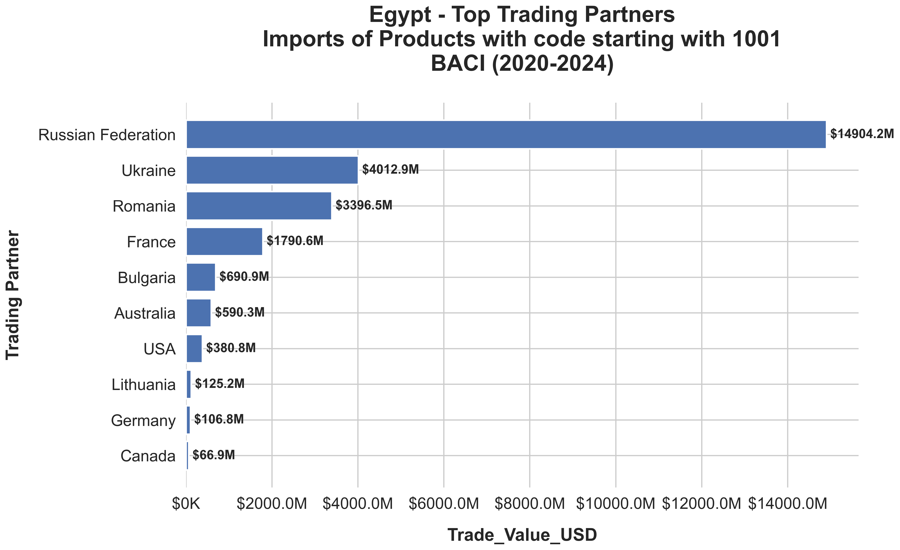

# International Trade Analyzer

A comprehensive Python tool for analyzing international bilateral trade flows using two complementary data sources: the **BACI database** and the **UN COMTRADE API**.

---

## Overview

The International Trade Analyzer enables researchers, economists, policy analysts, and trade professionals to explore and visualize global trade patterns with ease. Whether you're investigating a country's top trading partners for a specific commodity or analyzing trade trends over three decades, this tool provides the flexibility and depth needed for robust trade analysis.

### Key Features

- **Dual Data Source Support**
  - **BACI Database**: Harmonized bilateral trade data from 1995-2024 (annual), where discrepancies between exporter and importer reports are reconciled
  - **UN COMTRADE API**: Real-time trade data from 1962-present with annual and monthly frequency options

- **Interactive Command-Line Interface**
  - Guided step-by-step analysis workflow
  - Input validation with helpful error messages
  - Fuzzy matching for country name suggestions (handles typos like "Columbia" -> "Colombia")

- **Flexible Analysis Options**
  - Analyze trade with all partners or focus on a specific bilateral relationship
  - Support for HS (Harmonized System) product codes at 2-digit, 4-digit, and 6-digit levels
  - Automatic aggregation of product subcategories

- **Multiple Metrics**
  - Trade Value (USD)
  - Quantity (Metric Tons for BACI)
  - Additional COMTRADE metrics: FOB Value, CIF Value, Net Weight, Gross Weight

- **Professional Visualizations**
  - Bar charts for top trading partners
  - Stacked bar charts showing partner share over time
  - Subcategory breakdown charts

- **Comprehensive Data Export**
  - CSV files with all available metrics (sorted by selected metric)
  - Detailed text summaries
  - Year-by-year partner analysis with market share calculations

---

## Quick Start

```bash
# Clone the repository
git clone https://github.com/MoamenAbdelkawy/InternationalTradeAnalyzer.git
cd InternationalTradeAnalyzer

# Install dependencies
pip install -r requirements.txt

# Run the analyzer
python trade_analyzer.py
```

> **Note**: You'll need to download the BACI database and obtain a COMTRADE API key before using the tool. See the [Usage Guide](Usage_Guide.md) for detailed setup instructions.

---

## Data Sources

### BACI Database (CEPII)

BACI (Base pour l'Analyse du Commerce International) provides reconciled bilateral trade data where discrepancies between exporter-reported and importer-reported values have been harmonized using a sophisticated algorithm.

- **Coverage**: 1995-2024 (annual data)
- **Classification**: HS92 (Harmonized System 1992)
- **Metrics**: Trade Value (USD), Quantity (Metric Tons)
- **Source**: [CEPII BACI Database](https://www.cepii.fr/DATA_DOWNLOAD/baci/doc/baci_webpage.html)

### UN COMTRADE API

The United Nations COMTRADE database is the largest repository of international trade statistics, providing data as reported by individual countries.

- **Coverage**: 1962-present (annual and monthly data)
- **Classification**: HS (Harmonized System)
- **Metrics**: Primary Value, FOB Value, CIF Value, Quantity, Net Weight, Gross Weight
- **Source**: [UN COMTRADE](https://comtradeplus.un.org/)

---

## Project Structure

```
InternationalTradeAnalyzer/
├── trade_analyzer.py          # Main analysis script
├── requirements.txt           # Python dependencies
├── SUBSCRIPTION_KEY.env       # API credentials (user-configured)
├── LICENSE                    # MIT License
├── README.md                  # This file
├── Usage_Guide.md             # Detailed setup and usage instructions
│
├── comtradeapicall-main/      # UN COMTRADE API wrapper package
│   └── src/comtradeapicall/   # API modules
│
├── data/
│   ├── BACI/                  # BACI database files (user-downloaded)
│   │   └── BACI_HS92_V202601/ # Extracted BACI data
│   └── meta/                  # Reference data (country/product codes)
│
├── output/                    # Generated analysis results
│   ├── *.csv                  # Data exports
│   ├── *.txt                  # Summary reports
│   └── *.png                  # Visualizations
│
└── utils/                     # Development utilities
```

---

## Sample Output

### Bar Chart: Top Trading Partners


### CSV Export Structure

| Partner_Code | Partner_Name               | Trade_Value_USD       | Quantity_MT   |
| ------------ | -------------------------- | --------------------- | ------------- |
| 643          | Russian Federation         | $   14,904,222,968.00 | 31,026,962.26 |
| 804          | Ukraine                    | $   4,012,874,484.00  | 13,871,947.96 |
| 642          | Romania                    | $   3,396,469,970.00  | 8,979,856.75  |
| ...          | ...                        | ...                   | ...           |
| 0            | World (TOTAL - calculated) | $   26,252,394,275.00 | 63,277,724.83 |

---

## Requirements

- Python 3.7 or higher
- Required packages (see `requirements.txt`):
  - pandas
  - matplotlib
  - seaborn
  - python-dotenv
  - comtradeapicall

---

## Documentation

For detailed setup instructions, including:
- Downloading and installing Python
- Cloning the repository
- Obtaining and configuring data sources
- Step-by-step usage guide

Please see the **[Usage Guide](Usage_Guide.md)**.

---

## License

This project is licensed under the **MIT License** - see the [LICENSE](LICENSE) file for details.

The MIT License is a permissive open-source license that allows you to:
- Use the software for any purpose (personal, academic, commercial)
- Modify the source code
- Distribute copies of the original or modified software
- Include it in proprietary projects

The only requirement is that the original copyright notice and license text must be included in any copies or substantial portions of the software.

---

## Author

**Moamen Abdelkawy**

- Email: [moamen.abdelkawy@outlook.com](mailto:moamen.abdelkawy@outlook.com)
- GitHub: [Moamen-Abdelkawy](https://github.com/Moamen-Abdelkawy)

---

## Contributing

Contributions, suggestions, and bug reports are welcome! Please feel free to:

1. Open an issue to report bugs or suggest features
2. Submit a pull request with improvements
3. Contact me directly via email

---

## Acknowledgments

- **CEPII** for the BACI database
- **United Nations Statistics Division** for the COMTRADE database and API
- The open-source Python community for the excellent libraries that make this project possible

---

## Citation

If you use this tool in your research, please consider citing it:

```
Abdelkawy, M. (2026). International Trade Analyzer [Computer software].
https://github.com/MoamenAbdelkawy/InternationalTradeAnalyzer
```

---

*Last updated: February 2026*
